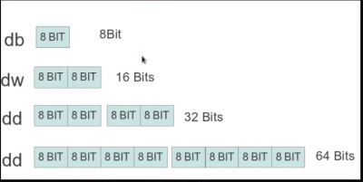
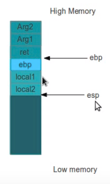

# NASM Training

In this training we are going to use (NASM) that is an assembler and disassembler for the Intel x86 architecture. It can be used to write 16-bit, 32-bit (IA-32) and 64-bit (x86-64) programs.

# Prerequirements

* For Mac

```
brew install binutils make nasm gcc
```
* For Linux

```
apt install make nasm gcc
```
* For Windows

Install cygwin and the packages: make, nasm, gcc, gcc-dev

IDE

[SASM](http://dman95.github.io/SASM) (Simple crossplatform IDE for NASM, MASM, GAS, FASM assembly)


# Intro







## Training

* [0x0 - Hello World](../../tree/master/0x00)

* [0x1 - Arithmetic ](../../tree/master/0x01)

* [0x2 - Args,LocalVar,etc ](../../tree/master/0x02)


## References

* [NASM](http://www.nasm.us)

* [Assembly Programming Unit](https://www.slideshare.net/infinite2me/assembly-language-programmingunit-4)

* [NASM Tutorial](http://cs.lmu.edu/~ray/notes/nasmtutorial)

* [x86 Assembly Guide](http://flint.cs.yale.edu/cs421/papers/x86-asm/asm.html)


